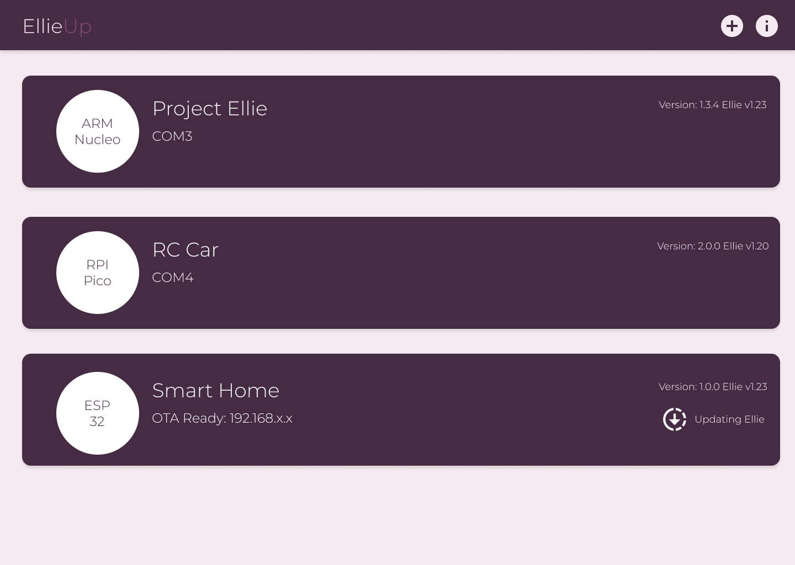

# Robotics with Ellie

While ellie works with low memory devices, standard libraries can power up microcontrollers with one standard library and third party libraries power up specific platforms with device capabilities.

## EllieUp

EllieUp will provide version updates to libraries and devices. Version control will be handled by github but package repositories will be kept in EllieUp servers.

### Early prototype of gui
